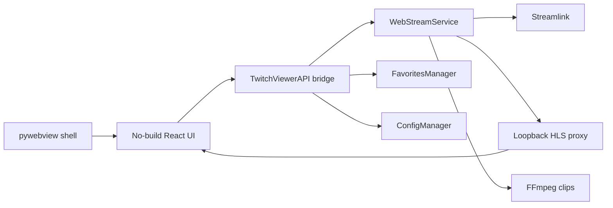

# twitch-ad-avoider

[](https://python.org)
[](https://opensource.org/licenses/MIT)
[](https://github.com/psf/black)

Watch Twitch streams through Streamlink in a clean desktop WebView app with embedded playback, favorites, status refresh, and local clipping.

## Features

- **Embedded playback**: Streamlink resolves Twitch HLS streams and the app plays them in the center video stage with hls.js.
- **Local playback proxy**: A loopback proxy rewrites playlists and segments so WebView2 can play the selected stream reliably.
- **Quality selection**: best, 720p, 480p, 360p, 160p, or worst.
- **Favorites rail**: Save channels, pin favorites, refresh live status, and select a channel from the Stream Manager.
- **Options rail**: Start/stop embedded playback, open the Twitch channel/chat in your browser, and choose quality.
- **Clipping**: Record the active Streamlink session and create local FFmpeg clips.
- **Settings**: JSON settings are validated, atomically saved, and migrated away from old external-player keys.

## Quick Start

### Windows EXE

Download the `twitchadavoider-vX.Y.Z.zip` from the Releases page, extract it, and run `twitchadavoider.exe` from inside the extracted folder (it needs its bundled support files alongside it). WebView2 is required on Windows and is already present on most Windows 10/11 installs.

### From Source

Use Python 3.12 or 3.13 for the smoothest Windows dev setup. Python 3.14 is intentionally excluded until pywebview/pythonnet supports it.

```powershell
python -m venv .venv
.\.venv\Scripts\Activate.ps1
pip install -e .[dev]
python main.py
```

Launch with a preselected channel:

```powershell
python main.py --channel theonlymonto --quality best
python main.py --debug
```

## Configuration

Settings live in `config/settings.json` and can be edited from the Settings view.

| Setting | Default | Description |
|---------|---------|-------------|
| `preferred_quality` | `"best"` | Stream quality |
| `twitch_low_latency` | `true` | Enable Twitch low-latency HLS mode |
| `hls_live_edge` | `3` | HLS segments buffered behind live |
| `clip_enabled` | `true` | Record active sessions for clipping |
| `clip_directory` | `"clips"` | Clip output folder |
| `ffmpeg_path` | `""` | Optional FFmpeg path; empty uses PATH |
| `network_timeout` | `30` | HTTP timeout in seconds |
| `connection_retry_attempts` | `3` | Stream reconnect attempts |
| `retry_delay` | `5` | Seconds between reconnect attempts |
| `dark_mode` | `true` | Dark interface |
| `window_width` | `1440` | Initial window width |
| `window_height` | `850` | Initial window height |

Legacy `player`, `player_path`, `player_args`, and external-player cache settings are removed during load migration.

## Architecture



| Component | Responsibility | File |
|-----------|----------------|------|
| `TwitchViewerAPI` | JS-callable bridge | `src/webapi.py` |
| `WebStreamService` | Streamlink resolution, proxy, recording, clips | `src/web_stream_service.py` |
| `ConfigManager` | Settings validation and migration | `src/config_manager.py` |
| `FavoritesManager` | Channel persistence and live status | `src/favorites_manager.py` |
| React UI | Stream Manager and Settings views | `gui_web/` |

## Development

```powershell
pip install -e .[dev]
python -m pytest tests/
make check
python main.py
python scripts/build_executable.py
```

## Troubleshooting

- **Stream will not start**: try a lower quality, increase `network_timeout`, and check `logs/twitch_ad_avoider.log`.
- **High latency**: keep `twitch_low_latency` enabled and lower `hls_live_edge` carefully.
- **Stutter or blocky frames**: raise `hls_live_edge` by 1 and retry.
- **Clip fails**: install FFmpeg or set `ffmpeg_path` in Settings.
- **Windows Python 3.14 error**: recreate the venv with Python 3.12 or 3.13.

## License

MIT License. See `LICENSE` for details.

## Acknowledgments

- [Streamlink](https://streamlink.github.io/)
- [pywebview](https://pywebview.flowrl.com/)
- [hls.js](https://github.com/video-dev/hls.js/)
